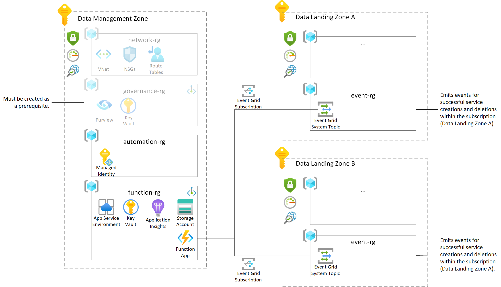

# Architecture

The architecture is built on top of Cloud Scale Analytics and can be deployed as natural extension to onboard data services at scale to your Azure Purviw Account. It is recommended to deploy the solution into the Data Management Zone as centralized solution and a System Event Grid Topic for the event driven automation in each and every Data Landing Zone. 

## Prerequisites

Before deploying the solution, the following resources must exist: Azure Purview, Azure Virtual Network with two subnets (one subnet being delegated to `Microsoft.Web/serverFarms` and a second subnet with `privateEndpointNetworkPolicies` set to `Disabled`) and Azure Private DNS Zones for Azure Blob Storage (`privatelink.blob.core.windows.net`), Azure File Storage (`privatelink.file.core.windows.net`) and Azure Key Vault (`privatelink.vaultcore.azure.net`). 

All of these services can be created quickly with the templates that are located in the [prerequisites folder](/docs/reference/prerequisites/).

## Architecture

The architecture is using Private Endpoints and Vnet injection across the board. It uspports a fully private Purview setup and just needs line of sight to the Private Endpoints of your Purview account. The solution consists of the following services:

* *Azure Event Grid System Topics*: The Azure Event Grid System Topics must be deployed per Azure Data Landing Zone. This requirement arises from the fact that an Event Grid System Topics can only subscribe to events coming from the subscription it was deployed in. The Event Grid System Topic receives events about successfully deployed and deleted Azure resources to which consumers can subscribe.

* *Azure Function running on App Service Environment*: The Azure Function is running the [.NET 6 application in this repo](/code/PurviewAutomation/). The Function subscribes to the events delivered by each and every Azure Event Grid System Topic in each Data Landing Zone. When a new event is received the Azure Function parses the event information about the successfully deployed Azure resources and onboards the service to the Azure Purview account to which is is connected to. When an event about a deleted service is received, the function will try to remove the data service from the respective collection in Purview.

* *Storage Account*: The storage account is used by the Azure Function and is required for it to properly function.

* *Application Insights*: Application insights is used to collect logs from the Azure Function.

* *Key Vault*: The Key Vault is used to store secrets and reference these from the Azure Function.
