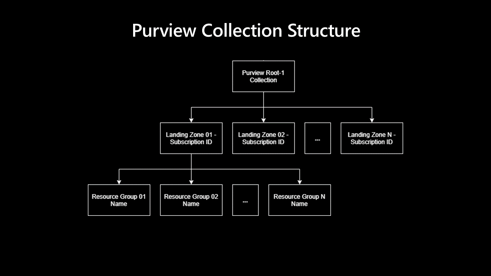

# Default Collection Structure

The solution automatically creates a collection structure within the Synapse workspace. The collection structure is created below the default Purview root collection.

The following picture illustrates the default collection strcuture that the solution creates:

If, for instance, a new storage account is created within a resource group within a connected subscription, the service 
first creates a collection below the root collection, if it not already exists. The name of the collection is the subscription ID. 

Below the subscription collection, the solution creates another collection with the name of the resource group, if it not already exists.

Within the resource group collection, the data source is onboarded.
